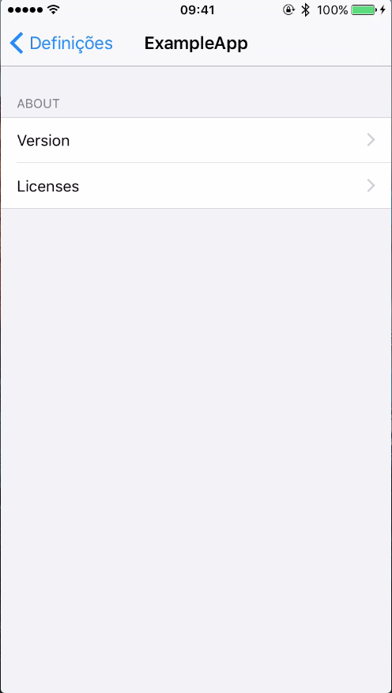
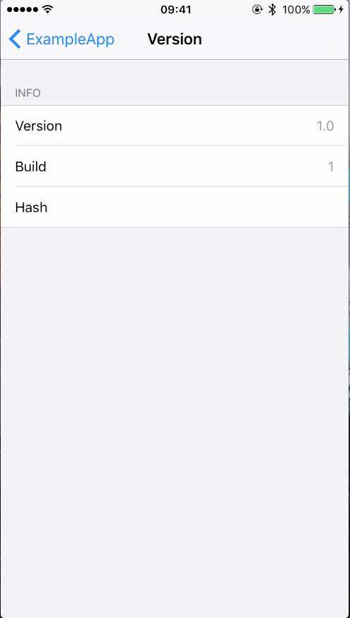
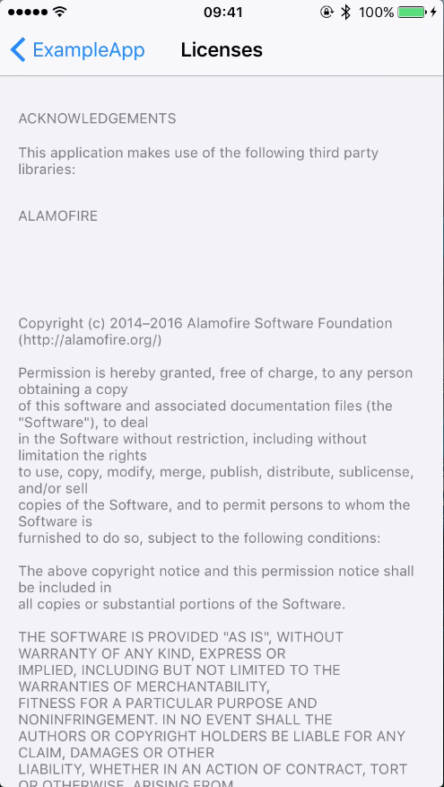

EasyAbout
======================
## Requirements: cocoapods version 1.4.0 or above.

## Why you should use

Well, it is always nice to give credit to the ones who helped you :smiley:
Bonus: it helps keeping track of the app version that is installed

## Example

<table>
 <tr>
  <td>
    
  </td>
  <td>
    
  </td>
  <td>
    
  </td>
 </tr>
</table>

## Install

Add to each wanted podfile target :

```ruby

pod 'EasyAbout'
script_phase :name => 'EasyAbout Setup', :script => '${PODS_ROOT}/EasyAbout/settings-script.sh'
```

## License

**EasyAbout** is available under the MIT license. See the [LICENSE](https://github.com/JARMourato/AcknowledgementsBundle/blob/master/LICENSE) file for more info.
