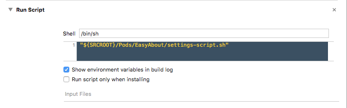

EasyAbout
======================
# WARNING: As of now will not work with cocoapods version 1.0.0. Will be updated shortly.

## Why you should use

Well, it is always nice to give credit to the ones who helped you :smiley:
Bonus: it helps keeping track of the app version that is installed

## Example

<table>
 <tr>
  <td>
    
  </td>
  <td>
    
  </td>
  <td>
    
  </td>
 </tr>
</table>

## Install

Add to podfile :

```ruby
platform :ios

pod 'EasyAbout'

```

Add a new run script: 

```ruby
"${SRCROOT}/Pods/EasyAbout/settings-script.sh"
```



## License

**EasyAbout** is available under the MIT license. See the [LICENSE](https://github.com/JARMourato/AcknowledgementsBundle/blob/master/LICENSE) file for more info.


